作成中

# 電子部品図鑑になるかもしれないページ

作りかけの電子部品図鑑です。解説はありません。たくさん写真を載せています。

* TOC
{:toc}

### ● 受動部品（Passive Components）

* 抵抗（Resistor）

  * チップ抵抗（SMD）
 
    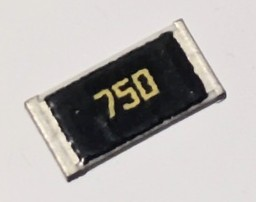
    
  * カーボン抵抗

    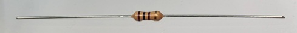

  * 金属皮膜抵抗
* コンデンサ（Capacitor）

  * セラミックコンデンサ

     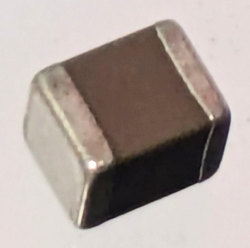

    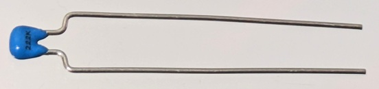

  * 電解コンデンサ（アルミ、タンタル）
    
    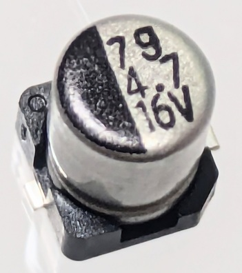
    
    ↑チップアルミ電解コンデンサ
    
    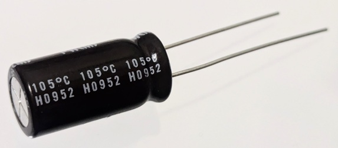
    
    ↑電解コンデンサ
    
    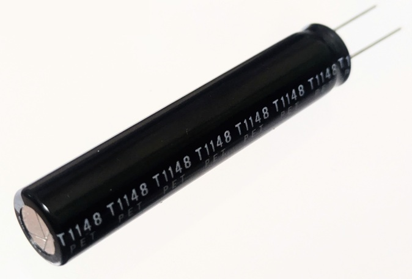
    
    ↑背の高い電解コンデンサ
    
  * フィルムコンデンサ
  
    
* コイル・インダクタ（Inductor）
 * インダクタ

　    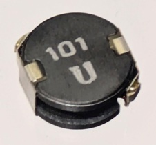
   
  * トロイダルコイル
  * フェライトビーズ
  * チョークコイル
* バリスタ

### ● 能動部品（Active Components）

* ダイオード（Diode）

  * 整流ダイオード
  * ショットキーダイオード
  * ツェナーダイオード
 
      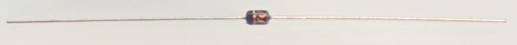
    
  * 発光ダイオード（LED）

    
 
    ↑チップLED

     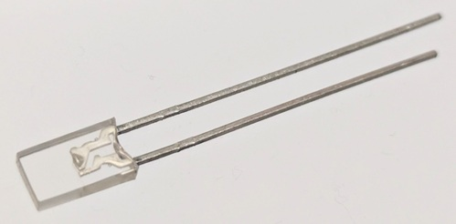
 
    ↑角型LED

    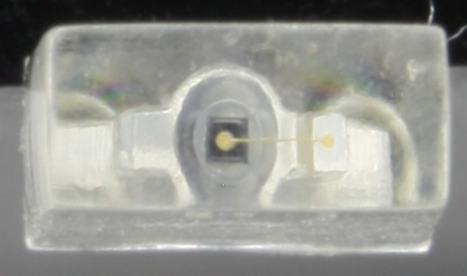

    ↑LEDの拡大

    * ブリッジダイオード
   
        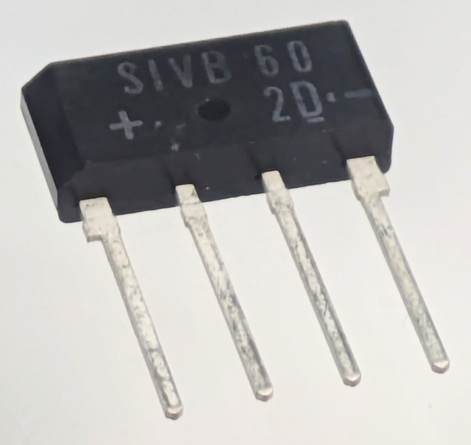
  
* トランジスタ（Transistor）

  * バイポーラトランジスタ（NPN/PNP）
  
  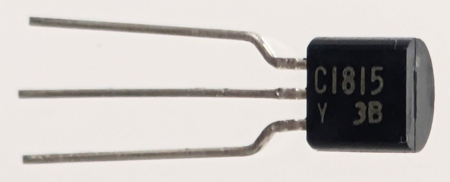

  ↑NPN型トランジスタ

  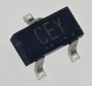

  ↑チップトランジスタ
    
  * MOSFET（Nチャネル/Pチャネル）
 
      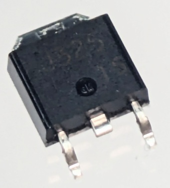
    
  * IGBT
* 集積回路（IC）

  * オペアンプ（例：LM358）

    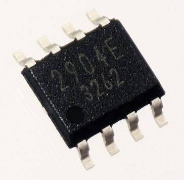

  * タイマーIC（例：NE555）
  * 電圧レギュレータ（例：7805, AMS1117）
  * ロジックIC（74HCシリーズ, 4000シリーズ）
  * ADC/DAC
  * EEPROM、フラッシュメモリ
  * FPGA、CPLD
  * マイコン（例：PIC, AVR, STM32, CH32V, ESP32, RP2040）
 
    

  ↑PICマイコンの例

### ● 電源関連部品（Power Components）

* 電源IC（DC/DC, LDO）

  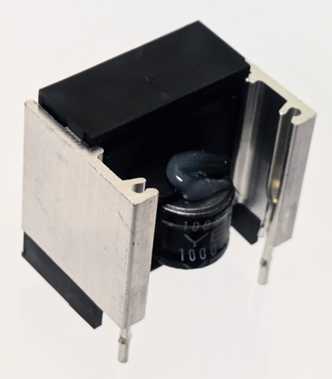
  
* ACアダプタ
* スイッチング電源モジュール
* リチウムイオン電池
* スーパーキャパシタ

    

### ● センサ（Sensor Components）

* 温度センサ（例：LM35、DHT11、DS18B20）
* 加速度センサ（MEMS）
* 磁気センサ（ホールIC）
* 光センサ（フォトダイオード、フォトトランジスタ）
* 圧力センサ
* 距離センサ（ToF, 超音波）

### ● インターフェース部品（Interface/Communication）

* UART/RS232/RS485トランシーバ
* USBトランシーバ/IC（例：CH340, CP2102）
* イーサネットIC（例：W5500）
* Bluetooth/Wi-Fiモジュール（例：ESP32, RN4020）
* Zigbee、LoRaモジュール

### ● 機構部品（Electromechanical Components）

* スイッチ（トグル、タクト、ロータリ）

    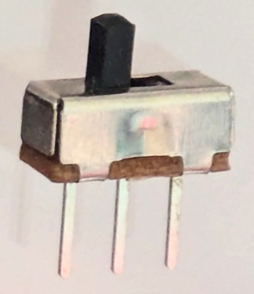

↑スライドスイッチ
 
* リレー（メカニカル、ソリッドステート）
  
    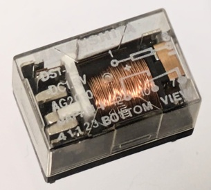
  
* - ソレノイド
* DCモーター

    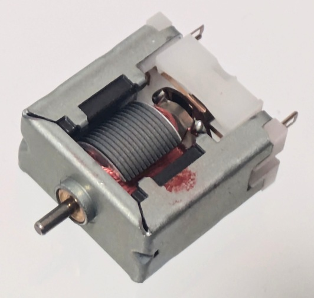
  
* ステッピングモーター
* サーボモーター
* コネクタ（ピンヘッダ、USB、JST）
* ジャンパー、ソケット、基板間コネクタ

### ● 表示部品（Display Components）

* 7セグメントLED
  
    

* キャラクタ液晶（HD44780系）
* OLEDディスプレイ（I2C/SPI）
* TFT液晶ディスプレイ
* e-Paperディスプレイ

  ### ● 熱制御・熱電変換部品（Thermal / Thermoelectric Components）
- ペルチェ素子（Peltier Device）

    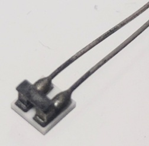
- 
- サーミスタ（NTC/PTC）
- バイメタルサーモスタット
- ヒートシンク
- TECコントローラ（ペルチェ駆動用IC）

# [HOME](https://mopurun.github.io/)

[管理用](https://github.com/mopurun/partsirb-easy)
